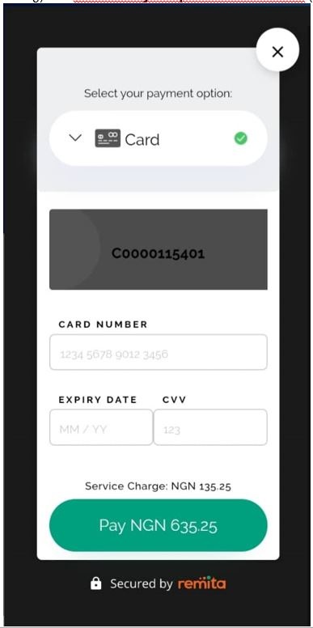
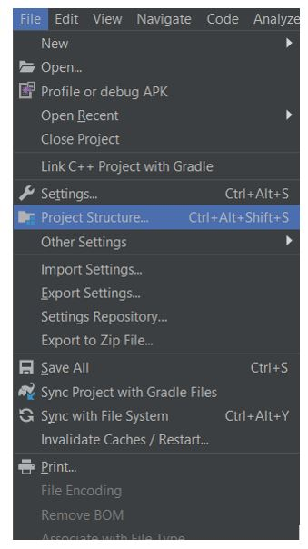
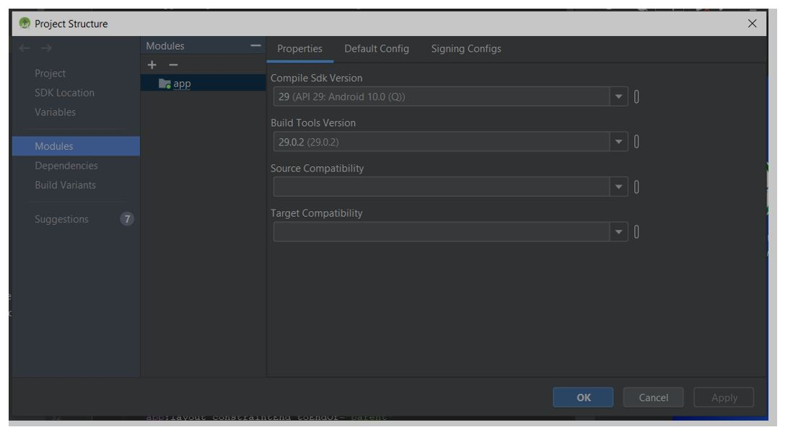
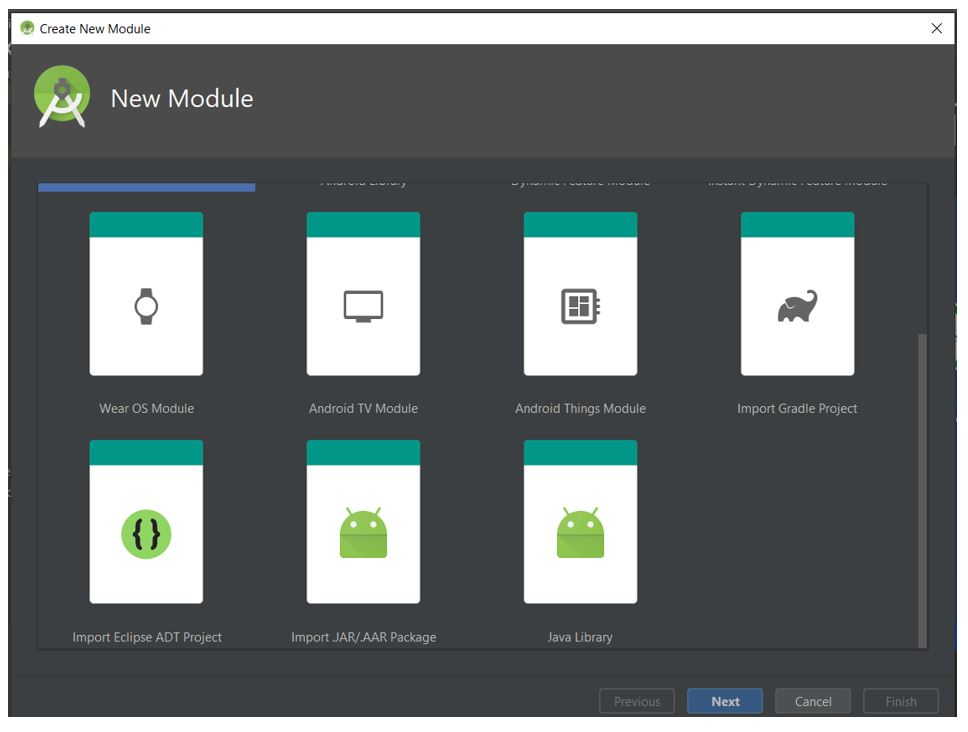
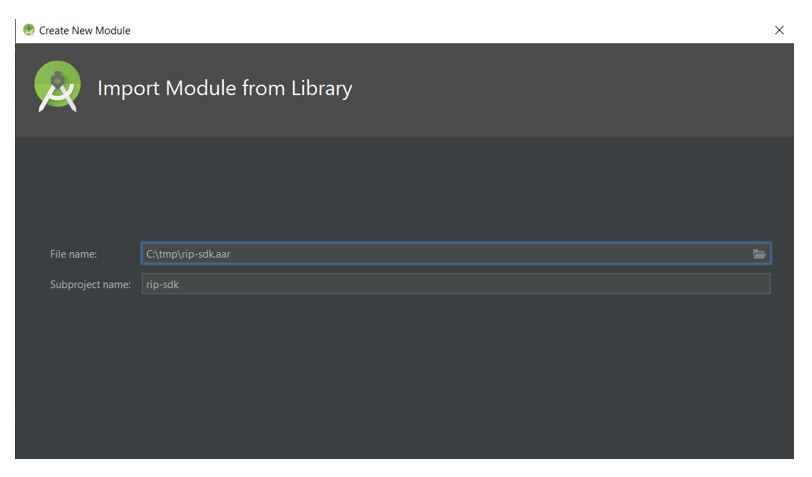
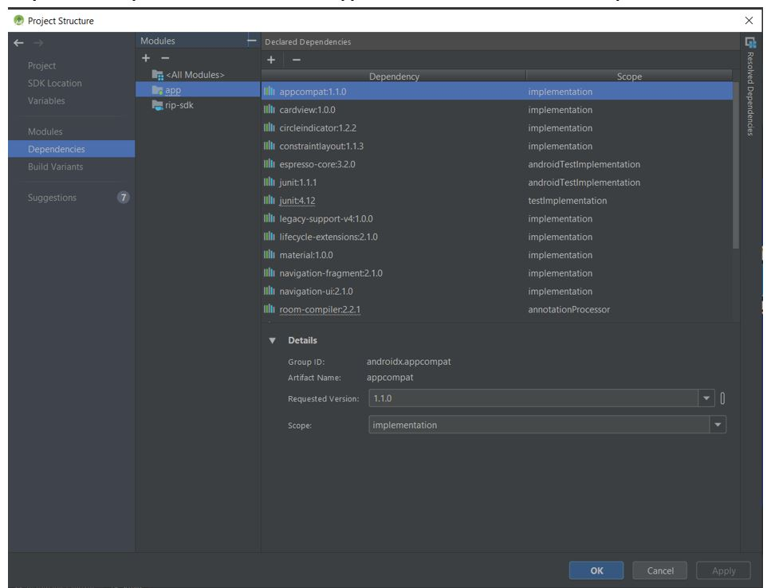
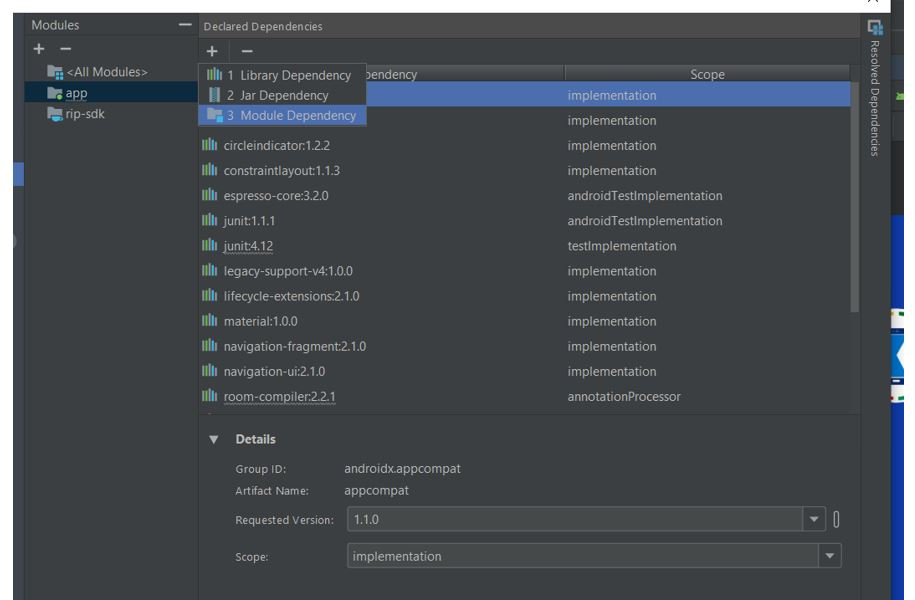
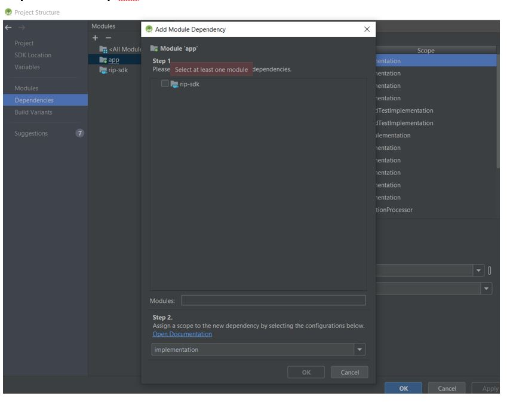
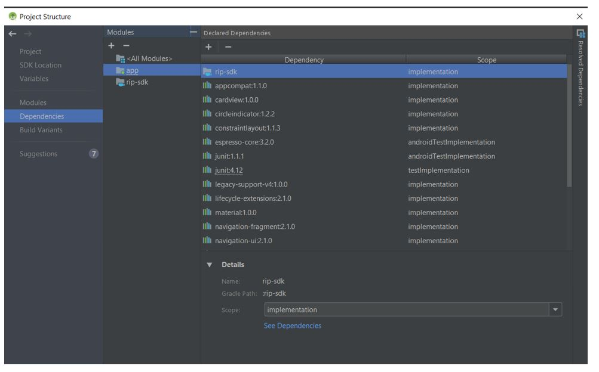
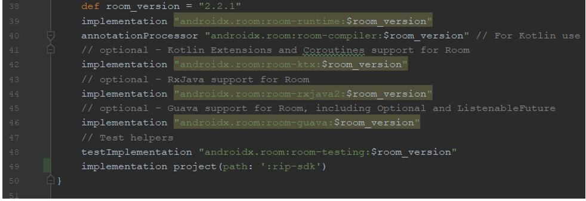

# Remita Inline Payment SDK

---
- [Overview](#Overview)
- [Installation](#Installation)
- [Usage](#Usage)
- [Contributing](#Contributing)
- [License](License)

---
## Overview
The following pages outlines the steps to integrating Remita Inline Payment SDK to your app.



---

## Installation
1. Go to **File** in Menu bar

2. Click on **Project Structure**


3. Select **Modules** and click the &quot; **+**&quot; under Modules section to add the &quot;rip-sdk.aar&quot; to your project.
Note: You can find the rip-sdk.aar at: https://github.com/RemitaNet/remita-inline-sdk-rrr-android/tree/main/aar


4. Select Import .JAR/.AAR Package
 

5. Locate rip-sdk.aar and click ok
 

6.Select **Dependencies** and then select **app** then click on &quot; **+&quot;** under **Declared Dependencies**

 
7. Select **Module Dependency**

 
8. Select the **rip-sdk** module and click &#39;OK&#39;.

 
9. Click on **Apply/Ok.**


10. Rebuild project, you should see **implementation project(path: &#39;:rip-sdk&#39;)** in your dependencies block.


11. Just in case
Add  **api 'com.google.code.gson:gson:2.8.2'** to your applications dependencies (If you haven't).

---

## Usage

You should invoke the RemitaInlinePaymentSDK.getInstance() at any point when making payment:

**Sample Code:**
```java
public class MainActivity extends AppCompatActivity implements RemitaGatewayPaymentResponseListener {

    Button btnGenRRR;
    Button btnProcessRRR;

    @Override
    protected void onCreate(Bundle savedInstanceState) {
        super.onCreate(savedInstanceState);
        setContentView(R.layout.remita_activity_main);

    btnProcessRRR = findViewById(R.id.btnProcessRRR);
           btnProcessRRR.setOnClickListener(new View.OnClickListener() {
               @Override
               public void onClick(View view) {

                   EditText etRRR = findViewById(R.id.etRRR);
                   String enteredRRR = etRRR.getText().toString();

                   String url = RIPGateway.Endpoint.DEMO;
                   String api_key = "QzAwMDAxNjMwNzl8NDA4NDEyMjQ0MHw0ODZkYTZkOTE4NTVhNzMzZmIzZTM5MTU2ZDBjZDYxY2Y4MzY4ODQ1NzRkYzIyOTI2OWQzMTU1M2NlNzdkNGZkZGIyNjI1MzA1ZjZkNzkzYzM2NTE4NzUxNTI0OWVjYjAxODUyNGZmYTM3NjY3M2IwZWNjYTU3OWEwYjE5NGMyNQ==";
                   String rrr = enteredRRR;

                   RemitaInlinePaymentSDK remitaInlinePaymentSDK = RemitaInlinePaymentSDK.getInstance();
                   remitaInlinePaymentSDK.setRemitaGatewayPaymentResponseListener(MainActivity.this);

                   remitaInlinePaymentSDK.initiatePayment(MainActivity.this, url, api_key, rrr);
               }
           });
    }

    @Override
    public void onPaymentCompleted(PaymentResponse paymentResponse) {

        Log.v("+++ Response: ", JsonUtil.toJson(paymentResponse));
        Toast.makeText(this, JsonUtil.toJson(paymentResponse), Toast.LENGTH_LONG);
    }
}
 ```

Where url can be:

**RIPGateway.Endpoint.DEMO** (for testing)  
                    OR  
**RIPGateway.Endpoint.PRODUCTION** (for live).

### Test Cards
```json
              CARD: 5178 6810 0000 0002,  
              Expire Date : 05/30,  
              CCV: 000, 
              OTP: 123456
```

### Useful links
Join our Slack Developer/Support channel on [Slack.](http://bit.ly/RemitaDevSlack)
    
### Support
For all other support needs, support@remita.net

---

## Contributing
To contribute to this repo, follow these guidelines for creating issues, proposing new features, and submitting pull requests:

1. Fork the repository.
2. Create a new branch: `git checkout -b "feature-name"`
3. Make your changes and commit: `git commit -m "added some new features"`
4. Push your changes: `git push origin feature-name`
5. Submit a Pull Request (PR).

Thank you!

---

## License

This project is licensed under the MIT License - see the [LICENSE.md](LICENSE.md) file for details.
